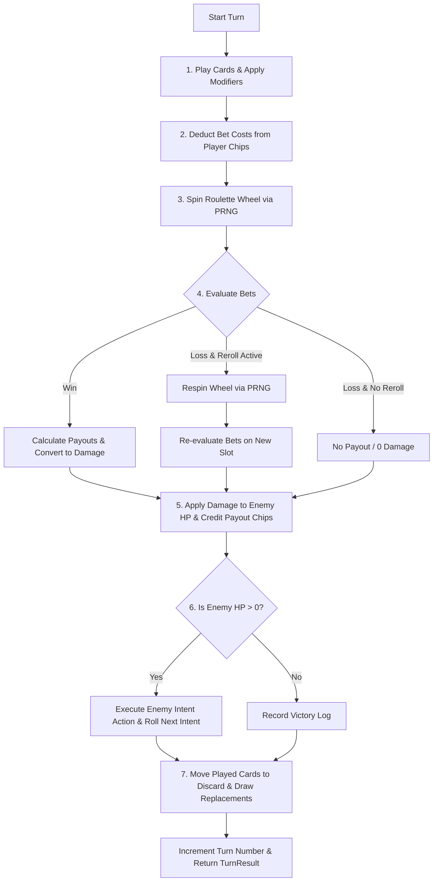

# `roulette_core` Technical Architecture & Design Specification

This document details the architectural design, state machine flow, mathematical model, and extension guidelines for `roulette_core`.

---

## 1. Engine Core Pillars

1. **Strict Determinism**: Given the same seed string (e.g. `"match_seed_402"`), the game engine produces identical outputs regardless of CPU architecture or OS.
2. **Zero Dependencies**: Standard library (`std`) only. No external crates (`rand`, `serde`, etc.) required for basic execution.
3. **Decoupled Graphics & Audio**: The core engine is purely headless logic, making it trivial to plug into WebAssembly, Unity, Godot, or server environments.

---

## 2. Turn Execution Lifecycle

When `CombatState::execute_turn` is invoked:



---

## 3. Module Specifications

### 3.1 `rng.rs` - Deterministic PRNG
- **Algorithm**: Mulberry32. A fast, 32-bit state PRNG with excellent statistical distribution for 32-bit seeds.
- **Seed Hashing**: Uses `djb2` string hashing algorithm (`hash = hash * 33 + byte`) to convert arbitrary seed strings into `u32` initialization values.
- **Shuffle**: In-place Fisher-Yates algorithm for shuffling card decks and discard piles.

### 3.2 `wheel.rs` - Roulette Wheel & Bet Rules
- **Slot Model**:
  ```rust
  pub struct Slot {
      pub number: u32,
      pub color: SlotColor, // Green, Red, Black
      pub multiplier_bonus: f64,
  }
  ```
- **Bet Evaluation Matrix**:
  | Bet Type | Target Criteria | Base Payout Multiplier |
  | :--- | :--- | :--- |
  | `Red` | `slot.color == SlotColor::Red` | `2.0x` |
  | `Black` | `slot.color == SlotColor::Black` | `2.0x` |
  | `Green` | `slot.color == SlotColor::Green` | `14.0x` |
  | `ExactNumber(N)` | `slot.number == N` | `36.0x` |
  | `Even` | `slot.number != 0 && slot.number % 2 == 0` | `2.0x` |
  | `Odd` | `slot.number != 0 && slot.number % 2 != 0` | `2.0x` |
  | `High` | `slot.number >= 19 && slot.number <= 36` | `2.0x` |
  | `Low` | `slot.number >= 1 && slot.number <= 18` | `2.0x` |

### 3.3 `cards.rs` - Cards & Modifier Lifecycle
- **Card Categories**:
  - `RouletteModifier`: Alters multipliers (e.g. `Red Fever` +0.5x).
  - `BoardModifier`: Alters physical slot count/colors (e.g. `Green Corruption` adds green slot; `Crimson Sector` recolors slots 1-12 to Red).
  - `RerollPhysics`: Grants conditional re-spins (e.g. `Second Chance`).
  - `RiskUtility`: Utility tradeoffs (e.g. `Blood Pact` -10 HP for +20 Chips; `Double Down` 2x payout).

### 3.4 `combat.rs` - Combat State & Enemy AI
- **Player State**: Max HP, current HP, chip balance, draw deck, active hand, discard stack.
- **Enemy State**: Name, HP, Max HP, current intent.
- **Enemy AI Intents**:
  - `Attack(damage)`: Direct player damage.
  - `Block(shield)`: Enemy health restoration/shielding.
  - `CorruptRed`: Board modification converting numbers 1-18 to Green.

---

## 4. WebAssembly & Unity Integration Plan

### WebAssembly (WASM) Target
To expose `roulette_core` to web-based frontends or browser engines:

1. Add `wasm-bindgen` to `Cargo.toml`.
2. Wrap `CombatState` in JS-friendly export structs:
   ```rust
   #[wasm_bindgen]
   pub struct WasmEngine {
       state: CombatState,
   }
   ```
3. Expose JSON-serialized turn execution for instant JS/Three.js rendering.

### Unity C# FFI Target
Compile `roulette_core` into a native dynamic library (`.dll` on Windows, `.so` on Linux, `.dylib` on macOS):

```rust
#[no_mangle]
pub extern "C" fn create_combat_state(seed: *const c_char) -> *mut CombatState;

#[no_mangle]
pub extern "C" fn execute_turn_ffi(state: *mut CombatState, bet_type: i32, bet_amount: u32) -> TurnResultFFI;
```
